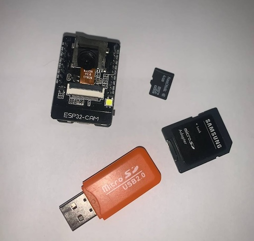
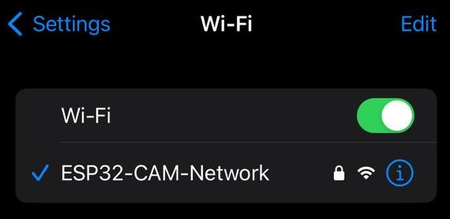
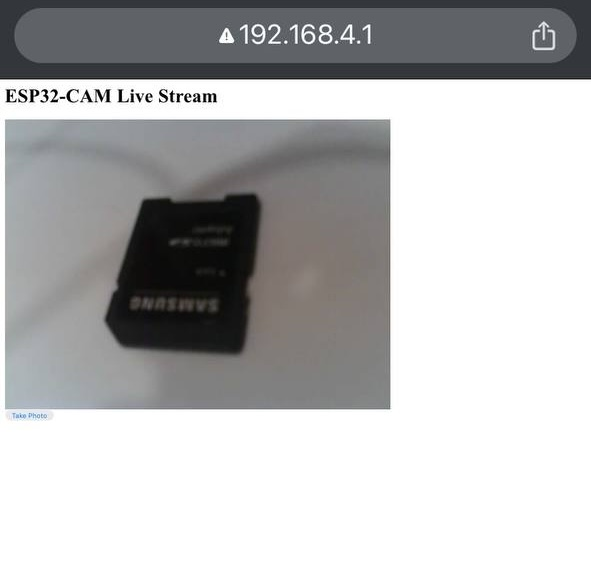
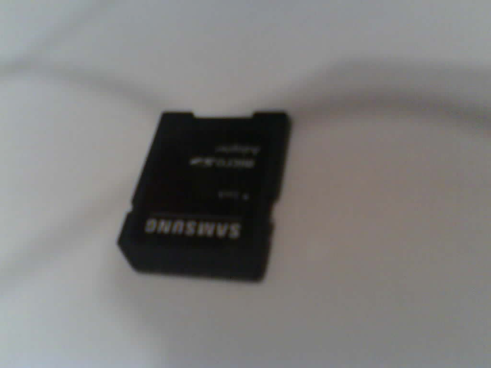

    This repository contains a project for implementing a camera based on the ESP32-CAM microcontroller.

# Tasks
The camera must perform the following tasks:

1. Taking a photo at the press of a button. The device must be able to
process a signal from an external button that initiates the process of capturing an image from the ESP32-CAM camera;

2. Converting an image to JPEG format with a resolution
of 1024x768 pixels. After capturing an image, it must be converted to JPEG format for efficient storage and subsequent processing. The resolution of 1024x768 pixels is chosen to ensure a balance between image quality and file size;

3. Saving an image to an SD card. After conversion, the image must be written to an SD memory card connected to the microcontroller, which will allow the user to save photos for further viewing or transferring to other devices.

# Hardware
The device implemented in this course project consists of three
main hardware units:

1. OV2640 camera module. This module provides image capturing and subsequent conversion into digital format for further
processing by the ESP32-cam microcontroller.

2. Memory based on a 4GB SD card. For long-term storage of images, an SD card is used, which is formatted in the FAT32 file system. This format is widely supported and allows you to easily work with
large files. In this project, the SD card is used to store pictures captured by the camera in JPEG format.

3. ESP32-cam microcontroller. This is the main computing unit
of the system, which controls the camera operation, image processing, saving data to the SD card and organizing interaction with the user via the web interface.

# Results
ArduinoIDE was used for flash the microcontroller and the HTML file of the page was previously located on SD card.

These photographs show the process of connecting to the camera.

These photographs show the process of photographing and the result.

# Plans 

The plans include connecting a CSS file for page design, as well as displaying a photographed image next to the live broadcast.